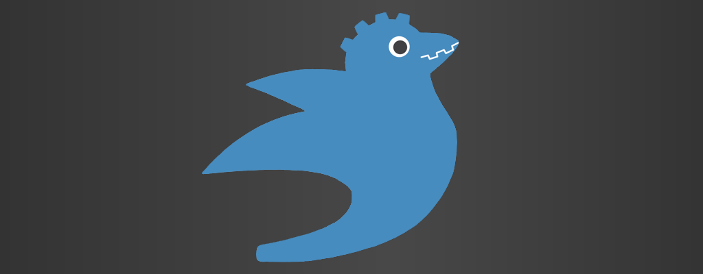

# bevy_godot4
# 

<!-- > **NOTICE**: This crate is currrently unmaintained, and due to changes in gdext's api it is pinned to an old version of gdext and only works with Godot 4.0 -->

Bring the design power of Bevy's ECS to the mature engine capabilities of Godot 4.

At it's core, this crate is just a godot Node that stores a Bevy `App` that you add as an autoload in your Godot project. However, this library also provides utilities to be able to work with Godot nodes from within the Bevy framework.

The architecture in this crate is based on [bevy_godot](https://github.com/rand0m-cloud/bevy_godot), a similar crate for working with Godot 3 and GDNative.

## Setup

1. Follow the steps outlined in the [GDExtension Getting Started](https://godot-rust.github.io/book/intro/index.html).

2. Add this library as a dependency (along with the GDExtension godot crate):
```toml
[dependencies]
bevy = { version = "0.16", default-features = false, features = [
    "bevy_asset",
    "bevy_state",
] }
bevy_godot4 = { git = "https://github.com/jrockett6/bevy_godot4", branch = "main" }
godot = "0.2.4"
```

> **_NOTE:_** You can, of course, enable other features in `bevy`; in the above
> example, we've simply minimized our feature set in order to minimize compile
> times and built-artifact size.

3. Create a function that takes a `&mut App` and builds your bevy app, and annotate it with `#[bevy_app]`:
```rust
#[bevy_app]
fn build_app(app: &mut App) {
    app.add_system(my_system)
}
```

4. Cargo build your project, and make sure the dll is found by Godot via the .gdextension file. You should now have the `BevyApp` Node avaiable to you in the Godot editor (you may need to refresh the project in the editor).

5. Add this `BevyApp` Node as a Godot autoload named `BevyAppSingleton` in the Godot project settings.

## Version Compatibility Matrix

| Godot-Bevy | Bevy | Godot-Rust | Godot |
|------------|------|------------|-------|
| 0.2.x      | 0.15 | 0.2.4      | 4.4.x |
| 0.3.x      | 0.16 | 0.2.4      | 4.4.x |


## Features

### Godot nodes as components
`ErasedGd` is a Bevy component that holds Godot node instance id's. You can `Query` for these and `get::<T>()` or `try_get::<T>()`  the node in your systems.
```rust
fn set_positions(mut erased_gds: Query<&mut ErasedGd>) {
    for mut node in erased_gds.iter_mut() {
        if let Some(node2D) = node.try_get::<Node2D>() {
            node2D.set_position(Vector2::ZERO)
        }
    }
}
```

### Godot resources as Bevy resources
Similarly, `ErasedGdResource` is `Send` & `Sync` and can hold your `RefCounted` Godot `Resource` types.
```rust
#[derive(Resource)]
pub struct GodotResources {
    pub my_packed_scene: ErasedGdResource,
}

impl Default for GodotResources {
    // load godot resource with e.g. the ResourceLoader singleton.
}

app.init_resource::<GodotResources>();
```

### Spawn Godot scenes from erased PackedScene resources
`GodotScene` will handle instancing `PackedScene`s, adding them to the scene tree, and adding the corresponding `ErasedGd` to work with from Bevy systems.
```rust
fn spawn_scene(
    godot_resources: Res<GodotResources>,
    mut commands: Commands,
) {
    commands.spawn(GodotScene::from_resource(godot_resources.my_packed_scene.clone()));
}
```

### Schedule systems for the _process or _physics_process update loops
`as_visual_system()` or `as_physics_system()` will ensure your Bevy systems run on the desired Godot update loop.
``` rust
app.add_system(set_positions.as_physics_system())
```

### Ensure Bevy systems are run on the main thread
`SceneTreeRef` is a `NonSend` system param that ensures your Bevy system will be scheduled on the main thread.
```rust
fn my_main_thread_system(
    ...,
    _scene_tree: SceneTreeRef,
) {
    // non-threadsafe code, e.g. move_and_slide()
}
```

*Checkout the examples folder for more.*


